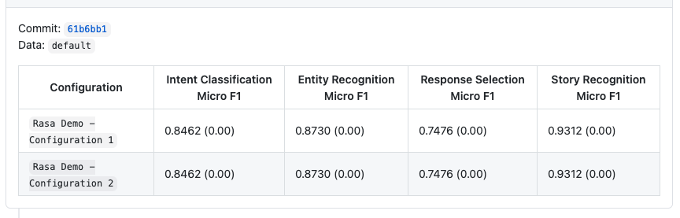

# Rasa Train and Test GitHub Action

The GitHub action to run easily `rasa train` and `rasa test` in the CIs.

## Input arguments

In order to pass the input parameters to the GH action, you have to use the [`with`](https://docs.github.com/en/actions/reference/workflow-syntax-for-github-actions#jobsjob_idstepswith) argument in a step that uses the GH action, e.g.

```yaml
jobs:
  my_first_job:
    steps:
      - name: My first step
        uses: RasaHQ/rasa-train-test-gha@master
        with:
          test_type: nlu
```

|        Input         |                                  Description                                  |          Default          |
| -------------------- | ----------------------------------------------------------------------------- | ------------------------- |
| `rasa_version`       | The Rasa version used to run test and train                                   | `latest-full`             |
| `rasa_image`         | Custom Docker image                                                           | `none`                    |
| `rasa_train`         | Run the rasa train                                                            | `true`                    |
| `rasa_test`          | Run the rasa test                                                             | `true`                    |
| `data_validate`      | Validates domain and data files to check for possible mistakes                | `true`                    |
| `workspace`          | The root directory                                                            | `${{ github.workspace }}` |
| `train_args`         | Additional arguments passed to the rasa train command                         | `none`                    |
| `test_args`          | Additional arguments passed to the rasa test command                          | `none`                    |
| `test_type`          | The types of tests to run (available types: core/nlu/all)                     | `all`                     |
| `publish_summary`    | Publish tests summary as a PR comment                                         | `true`                    |
| `github_token`       | GitHub Token - required to add a comment with summary                         | `none`                    |
| `configuration`      | Model configuration file                                                      | `config.yml`              |
| `model`              | Path to a file with a model. Use existing model instead of training a new one | `none`                    |
| `cross_validation`   | Switch on cross validation mode. Any provided model will be ignored           | `false`                   |
| `configuration_name` | Configuration name used in summary. If not provided a file name is used       | `none`                    |
| `data_name`          | Data name used in summary. If not provided a directory name is used           | `default`                 |
| `compare_report`     | Path to a report that will be used to compare results                         | `none`                    |

## Outputs

The list of available output variables:

|  Output  |      Description      |
| -------- | --------------------- |
| `report` | Return report as JSON |

## Example Usage

In the example below we are using the Rasa Demo:

```yaml
jobs:
    tran_and_test:
        # ...
        steps:
            # ...
            - name: Train and Test Rasa Demo
              uses: RasaHQ/rasa-train-test-gha@master
              with:
                # List of available tags: https://hub.docker.com/r/rasa/rasa/tags
                rasa_version: '2.0.0-full'
                github_token: ${{ secrets.GITHUB_TOKEN }}
            # ...
```

The GitHub action by default adds a PR commit with summary (the summary comment can be disable by setting the `publish_summary` input argument to `false`):


## Advanced examples - publish summary as a PR comment

### Compare results with the base report

It possible to compare result to the other report. Difference against the report that we compare to is included in brackets.

```yaml
jobs:
    tran_and_test:
        # ...
        steps:
            # ...
            - name: Train and Test Rasa Demo
              uses: RasaHQ/rasa-train-test-gha@master
              with:
                # List of available tags: https://hub.docker.com/r/rasa/rasa/tags
                rasa_version: '2.0.0-full'
                github_token: ${{ secrets.GITHUB_TOKEN }}
                compare_report: 'report_to_compare.json'
                test_type: 'nlu'
            # ...
```


### Publish results from multiple jobs as one comment

The example shows how to run to tests for two different configurations and publish summary as one comment.

```yaml
jobs:
    train_and_test_cfg_1:
        # ...
        steps:
            # ...
            - name: Train and Test Rasa Demo - configuration 1
              uses: RasaHQ/rasa-train-test-gha@master
              with:
                # List of available tags: https://hub.docker.com/r/rasa/rasa/tags
                rasa_version: '2.0.0-full'
                publish_summary: 'false'
                configuration_name: 'Rasa Demo - Configuration 1'
                configuration: 'test_config/config_1.yml'

            - uses: actions/upload-artifact@v2
              with:
                name: rasa-demo-cfg-1
                path: reports
            # ...

    train_and_test_cfg_2:
        # ...
        steps:
            # ...
            - name: Train and Test Rasa Demo - configuration 2
              uses: RasaHQ/rasa-train-test-gha@master
              with:
                # List of available tags: https://hub.docker.com/r/rasa/rasa/tags
                rasa_version: '2.0.0-full'
                publish_summary: 'false'
                configuration_name: 'Rasa Demo - Configuration 2'
                configuration: test_config/config_2.yml

            - uses: actions/upload-artifact@v2
              with:
                name: rasa-demo-cfg-2
                path: reports
            # ...

    train_and_test_publish_summary:
        # ...
        needs:
        - train_and_test_cfg_1
        - train_and_test_cfg_2
        steps:
            - uses: actions/download-artifact@v2
              with:
                name: rasa-demo-cfg-1

            - uses: actions/download-artifact@v2
              with:
                name: rasa-demo-cfg-2

            # ...
            - name: Train and Test Rasa Demo - publish summary
              uses: RasaHQ/rasa-train-test-gha@master
              with:
                data_validate: 'false'
                rasa_train: 'false'
                rasa_test: 'false'
                github_token: ${{ secrets.GITHUB_TOKEN }}
            # ...
```

Example of summary published as a PR comment:


